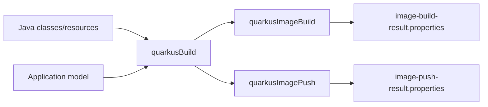
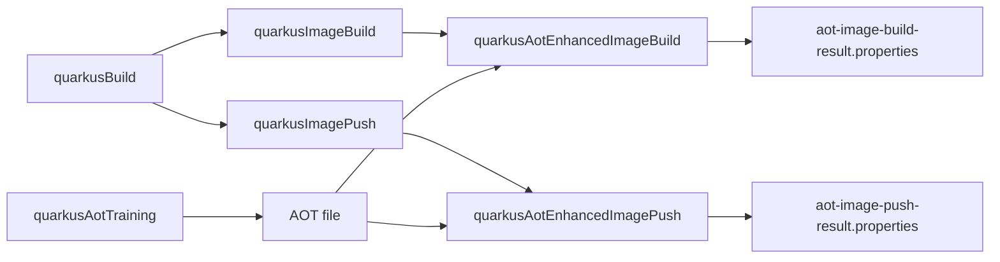
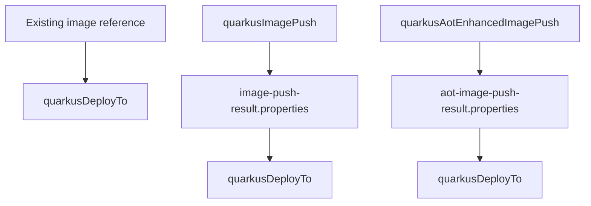

# P1-AP-02B Task Topology

Date: 2026-07-07

Status: reference topology; Phase B implementation completed and moved into
the standalone `io.quarkus.application` plugin under
`devtools/gradle/gradle-app-plugin`.

## Purpose

This document defines the intended task topology for the named Quarkus
application model. It records task name patterns, task types, registration
conditions, dependency intent, produced/consumed artifacts, and user-facing use
cases.

The goal is to separate:

- primitive execution tasks, which perform one explicit operation;
- convenience/lifecycle tasks, which compose primitive tasks without adding new
  behavior;
- legacy compatibility tasks, which remain unchanged until a later migration
  decision.

Phase B proper covers normal named-output image build/push tasks only. This
document also records later-phase topology for AOT-enhanced images, deployment,
native tests, and launch tasks so task names and dependencies stay coherent, but
those later sections are reference material unless a later implementation plan
explicitly pulls them forward.

## Completed Phase B Implementation Slices

Phase B was implemented in layers so image behavior did not hide configuration,
worker, or Gradle task-model mistakes.

### `P1-AP-02B0`: Config, Shape, And Receipt Infrastructure

Implement reusable infrastructure before real image execution:

- extract or mirror effective-config behavior into a descriptor-driven request
  model without reusing `EffectiveConfigProvider` as the named-output API;
- preserve SmallRye Config source ordering, raw-value/cache behavior,
  source-aware worker propagation, `quarkus.test.*` propagation, and worker
  system-property reset semantics documented in
  [Effective Config History And Reuse Notes](effective-config-history.md);
- make descriptor-owned shape properties explicit and force them at the
  operation layer;
- add post-effective-config validation that the resolved package/native/image
  shape matches the descriptor and selected task;
- introduce the image receipt support model:
  `ContainerImageTarget`, `BuiltContainerImage`,
  `BuiltContainerImageResultCodec`, and builder-specific extractor/generator
  interfaces;
- define receipt locations and fields without invoking container tooling;
- add pure unit tests for config planning, shape validation, receipt
  serialization/deserialization, and builder extractor edge cases.

B0 should not change legacy task behavior and should not require Docker,
Podman, Jib registry access, Kubernetes, OpenShift, or a full Quarkus
application build.

Expected B0 deliverables:

- `io.quarkus.gradle.application.internal.config` or equivalent package for
  descriptor-driven effective-config request/output records and planner logic;
- `io.quarkus.gradle.application.internal.execution` for
  `BuildOperations`, request records, and test-stub support;
- `io.quarkus.gradle.application.internal.image` or equivalent package for
  `ContainerImageTarget`, `BuiltContainerImage`,
  `BuiltContainerImageResultCodec`, and builder extractors;
- pure unit tests for the records, planner ordering, shape validation, receipt
  codec, and extractor matching/fallback behavior.

B0 is done when the new infrastructure can be exercised entirely from unit
tests, produces deterministic image receipts from synthetic inputs, validates
descriptor-owned shape keys, and has no task-registration or worker execution
dependency.

### `P1-AP-02B1`: Task Wiring With Stubbed Execution

Wire the named image tasks to the infrastructure while keeping execution cheap:

- configure managed Gradle inputs/outputs for `quarkus<Name>ImageBuild` and
  `quarkus<Name>ImagePush`;
- write deterministic receipt files through a stub/test operation interface;
- prove task names, dependencies, conventions, output directories, and receipt
  paths with ProjectBuilder and TestKit tests;
- verify that named-output common and image-specific `quarkusBuildProperties`
  merge in the intended order;
- verify that config files can influence ordinary build-time config but cannot
  change descriptor-owned shape;
- verify multiple named outputs do not share mutable forced-property state.

B1 should still avoid real image tooling. Its purpose is to prove the Gradle
model, managed properties, and test seams.

Expected B1 deliverables:

- `QuarkusApplicationImageBuildTask` and `QuarkusApplicationImagePushTask`
  actions wired to the operations seam;
- task registration that supplies descriptor/image properties, output roots,
  receipt paths, and operation intent without mutating
  `ForcedPropertieBuildService`;
- ProjectBuilder tests for registered task types, conventions, and provider
  wiring;
- TestKit tests using stub operations for task graph behavior, deterministic
  receipt files, multiple named outputs, and descriptor-shape validation.

B1 is done when `quarkus<Name>ImageBuild` and `quarkus<Name>ImagePush` can run
in a fixture without Docker or a registry, write expected receipt files, and
prove their Gradle inputs/outputs are stable.

### `P1-AP-02B2`: Worker-Backed Image Build/Push Execution

Connect the wired tasks to real Quarkus image build/push behavior:

- implement production operation interfaces that invoke the existing Quarkus
  worker/bootstrap machinery without `ForcedPropertieBuildService` mutation;
- feed descriptor/operation-owned forced properties into the effective config
  planner;
- extract image results from `AugmentResult`/`ArtifactResult` metadata and
  builder-specific side files where available;
- write normalized image build/push receipts;
- keep `quarkus<Name>ImagePush` as build-with-push-intent unless Quarkus later
  exposes a reliable standalone push operation;
- add focused TestKit/integration coverage for real image behavior, while
  keeping Docker/registry-dependent tests narrowly scoped and separately gated
  if needed.

The end state of Phase B is named-output image build/push tasks with stable
Gradle inputs/outputs, descriptor-owned shape validation, normalized receipt
files, and no legacy forced-property mutation. Deployment, native tests,
AOT-enhanced multi-step workflows, and broad lifecycle tasks remain later
phases unless explicitly pulled forward.

Expected B2 deliverables:

- production `BuildOperations` implementation backed by the
  existing app-model/effective-config/worker machinery;
- request construction that feeds descriptor-owned forced properties and
  image-scoped `quarkusBuildProperties` into the effective-config planner;
- result extraction from `AugmentResult.getResults()` and known builder side
  files where available;
- worker-oriented tests that prove request-to-worker mapping without broad
  container coverage;
- narrowly scoped image integration tests, gated when they need Docker,
  Podman, registry, or network behavior.

B2 is done when named image build/push tasks can invoke the real Quarkus path,
write normalized receipts from real image metadata, and preserve the legacy
image tasks unchanged.

## Naming Inputs

`<Name>` is the normalized task segment derived from the registered build name.
For example, build name `app` produces `App`, and build name `native1` produces
`Native1`.

`<Deployment>` is the normalized task segment derived from the named deployment.

Examples:

- `quarkusAppBuild`
- `quarkusNative1Build`
- `quarkusAppDeployToProd`

## Current Named Application Task Types

These task types exist as the named-application public surface. Some classes are
only placeholders for later phases; completed Phase B relies on the package,
build, and normal image task types.

| Task type | Role |
| --- | --- |
| `QuarkusApplicationTask` | Base named application task with common build-name/type/output inputs. |
| `QuarkusApplicationBuildTask` | Base task for operations that invoke Quarkus build behavior. |
| `QuarkusApplicationPackageTask` | Named JVM package output build task. |
| `QuarkusApplicationNativeTask` | Named native/native-sources output build task. |
| `QuarkusApplicationImageTask` | Base task for image-producing tasks. |
| `QuarkusApplicationImageBuildTask` | Named normal image build task. |
| `QuarkusApplicationImagePushTask` | Named normal image push task. |
| `QuarkusApplicationAotTrainingTask` | Named AOT training task that produces an AOT file. |
| `QuarkusApplicationAotEnhancedImageTask` | Base task for AOT-enhanced image-producing tasks. |
| `QuarkusApplicationAotEnhancedImageBuildTask` | Named AOT-enhanced image build task. |
| `QuarkusApplicationAotEnhancedImagePushTask` | Named AOT-enhanced image push task. |
| `QuarkusApplicationDeployTask` | Named deployment task. |
| `QuarkusApplicationNativeTestTask` | Named native-test task. |
| `QuarkusApplicationLaunchTask` | Base task for launch/dev/test style tasks. |
| `QuarkusApplicationRunTask` | Named run task. |
| `QuarkusApplicationDevTask` | Named dev-mode task. |
| `QuarkusApplicationRemoteDevTask` | Named remote-dev task. |
| `QuarkusApplicationContinuousTestTask` | Named continuous-test task. |

## Primitive Task Topology

### Build And Package Tasks

| Task name pattern | Task type | Registered when | Depends on | Consumes | Produces | Use case |
| --- | --- | --- | --- | --- | --- | --- |
| `quarkus<Name>Build` | `QuarkusApplicationPackageTask` | Registered output is a JVM package output. | Java/classes/resources and application model tasks needed by production build. | Named output config, normal application model, effective build properties. | Named output directory under `build/quarkus-builds/<name>/`. | Build one JVM package shape, such as fast jar, mutable jar, legacy jar, or uber jar. |
| `quarkus<Name>Build` | `QuarkusApplicationNativeTask` | Registered output is native executable or native sources. | Java/classes/resources and application model tasks needed by production build. | Named output config, normal application model, native build inputs. | Named native output directory under `build/quarkus-builds/<name>/`. | Build one native executable or native-sources output. |

The exact Java/classes/resources dependencies should follow the current Gradle
plugin behavior for `quarkusBuild`, but scoped to the named output.

### Image Tasks

Image tasks are primitive operations. They produce Gradle-owned result/receipt
files, not Gradle-owned image artifacts.

| Task name pattern | Task type | Registered when | Depends on | Consumes | Produces | Use case |
| --- | --- | --- | --- | --- | --- | --- |
| `quarkus<Name>ImageBuild` | `QuarkusApplicationImageBuildTask` | Registered output has `image {}`. | `quarkus<Name>Build`. | Named build output, `ContainerImageTarget`, image-scoped build properties, builder enum. | `image-build-result.properties`. | Build the configured image for the named output. |
| `quarkus<Name>ImagePush` | `QuarkusApplicationImagePushTask` | Registered output has `image {}`. | `quarkus<Name>Build`. | Named build output, `ContainerImageTarget`, image-scoped build properties, builder enum. | `image-push-result.properties`. | Build and push the configured image for the named output when Quarkus requires push intent during image creation. |

`quarkus<Name>ImagePush` should not initially depend on
`quarkus<Name>ImageBuild`. Current Quarkus container-image behavior generally
models push as build-with-push-intent, not as a standalone push of a Gradle-owned
image artifact. The push task therefore depends on the named build output and
writes its own receipt.

If a future implementation can reliably push an already-built image by
reference/digest, this dependency can be revisited.

Managed Gradle properties for Phase B image tasks:

| Property | Annotation | Task(s) | Required | Convention / source |
| --- | --- | --- | --- | --- |
| build name | `@Input` | both | yes | Registered `quarkusApplication.builds` name. |
| build type | `@Input` | both | yes | Registered output descriptor. |
| output root | `@InputDirectory` or `@Internal` plus concrete output inputs | both | yes | `build/quarkus-builds/<name>/`. |
| named build output | `@InputDirectory` / `@InputFile` as shape requires | both | yes | Provider from `quarkus<Name>Build`. |
| application model | `@InputFile` | both | yes | Existing app-model task output. |
| deployment/runtime classpath inputs | `@Classpath` | both | yes | Same classpath providers used by the production build worker path. |
| `ContainerImageTarget` | `@Nested` | both | yes | Descriptor `image {}` repository/tag, with tag defaulting from project version. |
| image builder | `@Input` | both | yes | Descriptor builder enum. |
| image build properties | `@Input` map | both | optional | Common plus image-scoped `quarkusBuildProperties`. |
| config input prefixes/names | `@Input` sets | all named application tasks | yes | Extension `configInputs {}` DSL. |
| legacy ambient config capture | `@Internal` property controlling cache behavior | all named application tasks | yes | Extension `configInputs {}` / `-PquarkusBuildLegacyAmbientConfigCapture=true`. |
| operation kind | `@Input` | both | yes | `BUILD` for image build, `PUSH` for image push. |
| receipt file | `@OutputFile` | both | yes | `build/quarkus-build-results/<name>/image/image-*-result.properties`. |
| operations service/test seam | `@Internal` | both | yes | Gradle service or injected helper; not part of task identity. |

`configInputs` defaults capture the built-in Quarkus/SmallRye ambient prefixes
plus any user-configured exact names or prefixes. Broad capture is available
only through legacy ambient capture, which disables build caching and
up-to-date behavior and opts the task out of configuration-cache reuse.

Image tasks should not be annotated `@CacheableTask` in Phase B. The receipt is
the Gradle-visible output, but the primary image artifact is external state.
The B1 stub path may demonstrate up-to-date behavior for receipt-only execution;
B2 should remain conservative until external image state semantics are proven.

## Later-Phase Reference Topology

The following topology keeps the larger design coherent but is not part of the
Phase B implementation plan unless explicitly pulled forward.

### AOT-Enhanced Image Tasks

| Task name pattern | Task type | Registered when | Depends on | Consumes | Produces | Use case |
| --- | --- | --- | --- | --- | --- | --- |
| `quarkus<Name>AotTraining` | `QuarkusApplicationAotTrainingTask` | Registered output has `aotEnhancedImage {}`. | Configured AOT training test suite/task dependencies. | Named output/test inputs. | Configured AOT file. | Run the training flow that emits the AOT file. |
| `quarkus<Name>AotEnhancedImageBuild` | `QuarkusApplicationAotEnhancedImageBuildTask` | Registered output has `aotEnhancedImage {}`. | `quarkus<Name>ImageBuild`, AOT file producer. | Base image receipt, AOT file, enhanced image target/reference. | `aot-image-build-result.properties`. | Build the current-platform AOT-enhanced image. |
| `quarkus<Name>AotEnhancedImagePush` | `QuarkusApplicationAotEnhancedImagePushTask` | Registered output has `aotEnhancedImage {}`. | `quarkus<Name>ImagePush`, AOT file producer. | Base pushed-image receipt, AOT file, enhanced image target/reference. | `aot-image-push-result.properties`. | Build and push the current-platform AOT-enhanced image. |

The AOT-enhanced build/push tasks are current-platform convenience tasks. They
do not attempt to automate multi-platform AOT image assembly.

### Deployment Tasks

| Task name pattern | Task type | Registered when | Depends on | Consumes | Produces | Use case |
| --- | --- | --- | --- | --- | --- | --- |
| `quarkus<Name>DeployTo<Deployment>` | `QuarkusApplicationDeployTask` | Registered output has a named deployment factory such as `kubernetes(...)`, `openshift(...)`, `knative(...)`, `kind(...)`, or `minikube(...)`. | Depends on selected image source. | Deployment target, image source, optional existing image reference or image receipt. | Deployment receipt; external deployment side effect. | Deploy the named output to one named environment/target. |

Deployment dependency by `imageSource`:

| Image source | Deploy dependency | Deploy input |
| --- | --- | --- |
| `EXISTING_IMAGE` | None from image tasks. | Explicit image reference configured on deployment. |
| `NORMAL_IMAGE_PUSH` | `quarkus<Name>ImagePush`. | Normal image push receipt. |
| `AOT_ENHANCED_IMAGE_PUSH` | `quarkus<Name>AotEnhancedImagePush`. | AOT-enhanced image push receipt. |

Deploy tasks should remain non-cacheable because they mutate external state.
They should still expose modeled inputs and a deterministic receipt file for
configuration-cache correctness, diagnostics, and downstream Gradle wiring.

### Test And Launch Tasks

These tasks are part of the eventual named-output model, but their real behavior
is deferred beyond Phase B unless explicitly pulled forward.

| Task name pattern | Task type | Registered when | Depends on | Consumes | Produces | Use case |
| --- | --- | --- | --- | --- | --- | --- |
| `quarkus<Name>NativeTest` | `QuarkusApplicationNativeTestTask` | Registered output is native executable. | Native output and configured native-test suite/test task. | Native executable, test app model, test runtime config. | Test results. | Run integration/native tests against one named native output. |
| `quarkus<Name>Run` | `QuarkusApplicationRunTask` | Registered output is a JVM package build. | Matching package build task. | Package output, named build config, run options. | External process; no cacheable output. | Run a named JVM package output through Quarkus `Mode.RUN` augmentation. |
| `quarkus<Name>ContinuousTest` | `QuarkusApplicationContinuousTestTask` | Named continuous test support is enabled. | Source/test classes and app models needed by Quarkus continuous test. | Named build config, dev/test app models. | External long-running process; no cacheable output. | Run Quarkus continuous testing for one named output. |
| `quarkus<Name>Dev` | `QuarkusApplicationDevTask` | Named dev support is enabled. | Source/classes and app models needed by dev mode. | Named build config, dev/test app models. | External long-running process; no cacheable output. | Run Quarkus dev mode for one named output. |
| `quarkusApplicationRemoteDev` | `QuarkusApplicationRemoteDevTask` | Standalone remote-dev support is enabled. | Internal `quarkusApplicationRemoteDevBuild` mutable-jar package producer. | Remote-dev config and invocation options. | External long-running process; no cacheable output. | Run remote dev using the plugin-owned mutable package output. |

## Convenience / Lifecycle Tasks

Do not add broad convenience tasks until they remove a real repeated workflow.
The primitive task names are already explicit and Gradle-style.

Initial convenience stance:

| Candidate task | Decision | Rationale |
| --- | --- | --- |
| `quarkus<Name>PublishImage` | Do not add initially. | `quarkus<Name>ImagePush` already clearly expresses build+push intent in current Quarkus semantics. |
| `quarkus<Name>Deploy` | Do not add initially. | Ambiguous once more than one deployment exists. Use `quarkus<Name>DeployTo<Deployment>`. |
| `quarkus<Name>AotEnhancedImagePublish` | Do not add initially. | `quarkus<Name>AotEnhancedImagePush` is explicit enough. |
| Aggregate all named builds | Defer. | Could be useful later, but lifecycle indirection should wait until primitive behavior is proven. |
| Aggregate all deployments | Defer. | Risky because deployment mutates external state; users should choose deployments explicitly. |

If a convenience task is added later, it must be lifecycle-only: no extra
runtime behavior, only dependencies on primitive tasks.

## Mermaid Flow Diagrams

### Normal Image Flow

`ImagePush` is shown as a sibling of `ImageBuild` because current Quarkus image
push behavior is build-with-push-intent.

### AOT-Enhanced Image Flow

### Deployment Flow

The three deploy nodes represent the same task type with different
`imageSource` configuration.

## Result File Boundary

Image result files are the Gradle-visible output boundary. A task that needs
the image produced by another task must depend on and read the receipt file,
not an in-memory object.

Required support model:

- `ContainerImageTarget`: nested input bean for intended image target;
- `BuiltContainerImage`: normalized Java result object;
- `BuiltContainerImageResultCodec`: stable receipt serializer/deserializer;
- builder-specific extractors/generators for Jib, Docker/Podman, Buildpack,
  OpenShift, and AOT-enhanced image results.

Receipt schema and field requiredness are defined in
[P1-AP-02B AugmentResult Image Metadata Investigation](phase-b-augment-result-image-metadata.md).
The codec writer must use `io.quarkus.bootstrap.util.PropertyUtils.store(...)`
for deterministic `.properties` output without a timestamp/date comment.
Unknown fields must be omitted.

## Cacheability Stance

| Task group | Initial stance |
| --- | --- |
| Package/native build tasks | Review per output type; use Gradle outputs where the filesystem output is owned by the task. |
| Image build task | Conservative. It writes a receipt file but also creates external image state. Do not mark cacheable until external-state semantics are proven acceptable. |
| Image push task | Non-cacheable. Push mutates external registry state. |
| AOT training task | Can be cacheable only if test-suite inputs/outputs are modeled correctly; defer. |
| AOT-enhanced image build task | Conservative for the same reason as image build. |
| AOT-enhanced image push task | Non-cacheable. Push mutates external registry state. |
| Deploy task | Non-cacheable. Deploy mutates external cluster/platform state. |
| Dev/run/continuous-test tasks | Non-cacheable. They launch processes or watch state. |

## Legacy Compatibility Tasks

Legacy tasks remain unchanged until an explicit migration phase:

- `quarkusBuild`
- `imageBuild`
- `imagePush`
- `buildNative`
- `testNative`
- `deploy`
- `buildAotEnhancedImage`
- `quarkusRun`
- `quarkusDev`
- `quarkusRemoteDev`
- `quarkusTest`

Diagnostics may warn about legacy model usage, but this topology does not
remove or reroute legacy task behavior. Diagnostics target lists can be narrower
than this compatibility list when a legacy task has no modeled replacement yet.
